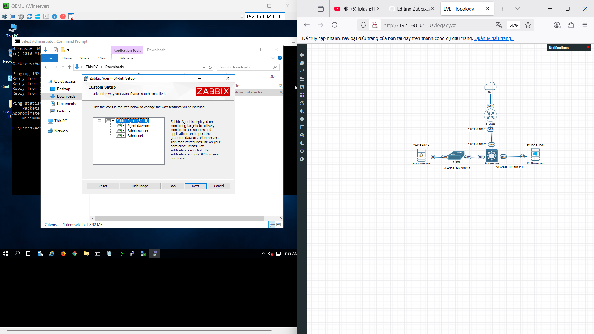
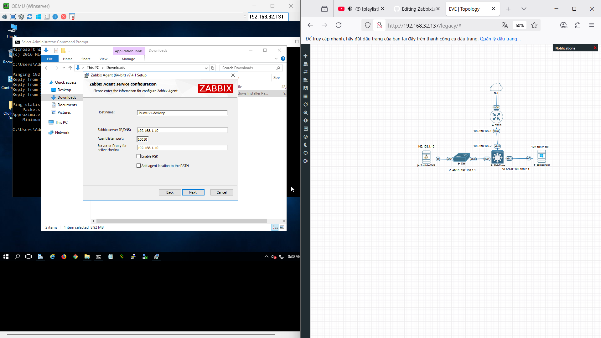

# Zabbix Lab
## Giới thiệu dự án
Mục tiêu:  
- Triển khai hệ thống giám sát hạ tầng mạng bằng Zabbix.  
- Giám sát trạng thái thiết bị mạng, máy chủ Windows/Linux.  
- Thu thập thông tin CPU, RAM, Disk, lưu lượng mạng, và tình trạng kết nối ICMP.  
- Hiển thị dữ liệu giám sát trên dashboard tập trung.  
  
Yêu cầu phần mềm:  
- Hệ điều hành Zabbix Server: Ubuntu Server 22.04 LTS.  
- Hệ điều hành máy chủ Windows: Windows Server 2019.  
- Zabbix: Zabbix Server 7.4, Zabbix Frontend, Zabbix Agent 2.  
- Database: MariaDB hoặc MySQL.  
- Phần mềm hỗ trợ: Apache/Nginx, PHP 7.4 trở lên.  

Mô tả chung:  
Mô hình gồm một Zabbix Server (Linux) đặt ở VLAN10 và một Windows Server đặt ở VLAN20. Các VLAN được định tuyến thông qua Switch Layer 3 và Router. Zabbix Server cài đặt dịch vụ Zabbix và frontend để quản lý, trong khi Windows Server cài đặt Zabbix Agent để gửi dữ liệu giám sát.  
  
## Sơ đồ mạng
#### Sơ đồ mạng
  
  
Giải thích vai trò từng thành phần  
Router 3725:
- Kết nối mạng nội bộ với mạng ngoài.
- IP fa0/0: 192.168.100.1
- IP fa0/1: kết nối Internet

SW-Core:  
- Switch Layer 3, định tuyến giữa các VLAN.
- VLAN10: 192.168.1.1 (Zabbix-SVR)
- VLAN20: 192.168.2.1 (Winserver)
- IP Layer 3 trên SW-Core kết nối uplink đến Router: 192.168.100.2

SW:  
- Switch Access, kết nối Zabbix-SVR với SW-Core qua VLAN10.

Zabbix-SVR:  
- IP: 192.168.1.10
- Chạy Ubuntu Server, cài Zabbix Server + Frontend.

Winserver:  
- IP: 192.168.2.100
- Chạy Windows Server, cài Zabbix Agent.  
## Cài đặt cấu hình Zabbix Server
Link cấu hình: https://www.zabbix.com/download?zabbix=7.4&os_distribution=ubuntu&os_version=22.04&components=server_frontend_agent&db=mysql&ws=apache  
B1: Chuyển sang quyền quản trị  
sudo -s  
B2: Cài đặt kho lưu trữ Zabbix  
wget https://repo.zabbix.com/zabbix/7.4/release/ubuntu/pool/main/z/zabbix-release/zabbix-release_latest_7.4+ubuntu22.04_all.deb  
dpkg -i zabbix-release_latest_7.4+ubuntu22.04_all.deb  
apt update  
B3: Cài đặt Zabbix server, frontend, agent  
apt install zabbix-server-mysql zabbix-frontend-php zabbix-apache-conf zabbix-sql-scripts zabbix-agent  
B4: Tạo cơ sở dữ liệu  
mysql -uroot -p (mật khẩu mặc định: password)  
mysql> create database zabbix character set utf8mb4 collate utf8mb4_bin;  
mysql> create user zabbix@localhost identified by 'password';  
mysql> grant all privileges on zabbix.* to zabbix@localhost;  
mysql> set global log_bin_trust_function_creators = 1;  
mysql> quit;  
  
zcat /usr/share/zabbix/sql-scripts/mysql/server.sql.gz | mysql --default-character-set=utf8mb4 -uzabbix -p zabbix  
  
Vô hiệu hóa tùy chọn log_bin_trust_function_creators:  
mysql -uroot -p  
mysql> set global log_bin_trust_function_creators = 0;  
mysql> quit;  
  
B4: Cấu hình database cho Zabbix server  
Vào cấu hình file Zabbix server: /etc/zabbix/zabbix_server.conf  
Xóa comment đoạn: DBPassword=, và thêm password (ví dụ: DBPassword=password)  

B5: Khởi động Zabbix server and agent  
systemctl restart zabbix-server zabbix-agent apache2  
systemctl enable zabbix-server zabbix-agent apache2  

B6: Truy cập vào Web ui bằng IP host zabbix server  
  
## Cài đặt Zabbix Agent
Vào website Zabbix cài đặt Zabbix agent  
  

Chọn nơi lưu trữ Zabbix agent  
  
  
Đặt IP theo Zabbix Server  
  
  
## Thêm host và cấu hình giám sát
Thêm host agent của Window server:  
Thêm Switch layer 3:  
Thêm Cisco Asav:  

## Kiểm tra và xác thực giám sát
