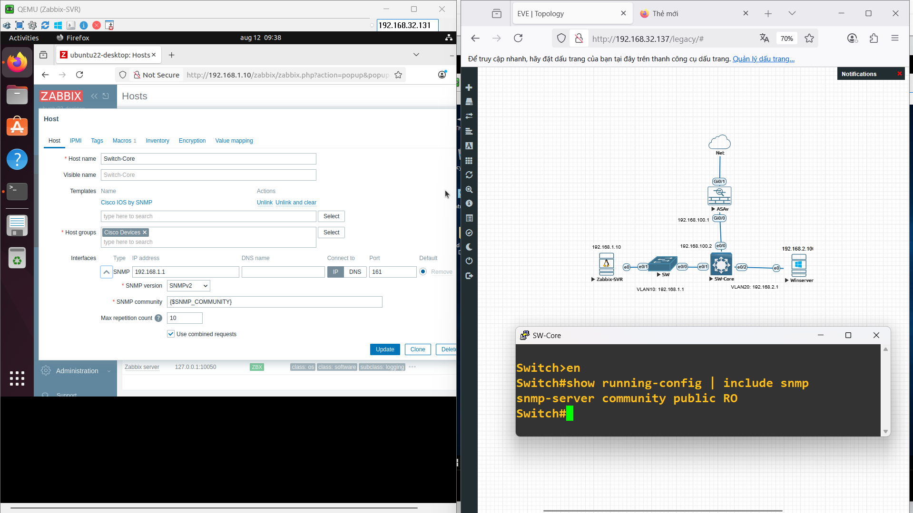

# Zabbix Lab
## Giới thiệu dự án
Mục tiêu:  
- Triển khai hệ thống giám sát hạ tầng mạng bằng Zabbix.  
- Giám sát trạng thái thiết bị mạng, máy chủ Windows/Linux.  
- Thu thập thông tin CPU, RAM, Disk, lưu lượng mạng, và tình trạng kết nối ICMP.  
- Hiển thị dữ liệu giám sát trên dashboard tập trung.  
  
Yêu cầu phần mềm:  
- Hệ điều hành Zabbix Server: Ubuntu Server 22.04 LTS.  
- Hệ điều hành máy chủ Windows: Windows Server 2019.  
- Zabbix: Zabbix Server 7.4, Zabbix Frontend, Zabbix Agent 2.  
- Database: MariaDB hoặc MySQL.  
- Phần mềm hỗ trợ: Apache/Nginx, PHP 7.4 trở lên.  

Mô tả chung:  
Mô hình gồm một Zabbix Server (Linux) đặt ở VLAN10 và một Windows Server đặt ở VLAN20. Các VLAN được định tuyến thông qua Switch Layer 3 và Router. Zabbix Server cài đặt dịch vụ Zabbix và frontend để quản lý, trong khi Windows Server cài đặt Zabbix Agent để gửi dữ liệu giám sát.  
  
## Sơ đồ mạng
#### Sơ đồ mạng
  
  
Cấu hình Core Switch và Cisco Asav:  
Switch Core:  
! VLAN 10   
vlan 10  
 name VLAN10  
!  
interface vlan 10  
 ip address 192.168.1.1 255.255.255.0  
 no shutdown  
!  
! VLAN 20  
vlan 20  
 name VLAN20  
!  
interface vlan 20  
 ip address 192.168.2.1 255.255.255.0  
 no shutdown  
!  
!  
interface e0/0
 no switchport
 ip address 192.168.100.2 255.255.255.0  
 no shutdown  
!  
interface e0/1  
 switchport mode access  
 switchport access vlan 10  
!    
interface e0/2  
 switchport mode access  
 switchport access vlan 20  
!  
ip routing  
ip route 0.0.0.0 0.0.0.0 192.168.100.1  
!  
snmp-server community public RO  
  
Cisco Asav:  
! Inside interface  
interface g0/0  
 nameif inside  
 security-level 100  
 ip address 192.168.100.1 255.255.255.0  
 no shutdown  
! Outside interface  
interface g0/1  
 nameif outside  
 security-level 0  
 ip address dhcp setroute  
 no shutdown  
!  
route inside 192.168.0.0 255.255.0.0 192.168.100.2  
!  
object network LAN  
 subnet 192.168.0.0 255.255.0.0  
 nat (inside,outside) dynamic interface  
!  
policy-map global_policy  
 class inspection_default  
  inspect icmp  
  inspect icmp error  
!  
!  
snmp-server community public  
snmp-server host inside 192.168.1.10 community public  
  
## Cài đặt cấu hình Zabbix Server
Link cấu hình: https://www.zabbix.com/download?zabbix=7.4&os_distribution=ubuntu&os_version=22.04&components=server_frontend_agent&db=mysql&ws=apache  
B1: Chuyển sang quyền quản trị  
sudo -s  
B2: Cài đặt kho lưu trữ Zabbix  
wget https://repo.zabbix.com/zabbix/7.4/release/ubuntu/pool/main/z/zabbix-release/zabbix-release_latest_7.4+ubuntu22.04_all.deb  
dpkg -i zabbix-release_latest_7.4+ubuntu22.04_all.deb  
apt update  
B3: Cài đặt Zabbix server, frontend, agent  
apt install zabbix-server-mysql zabbix-frontend-php zabbix-apache-conf zabbix-sql-scripts zabbix-agent  
B4: Tạo cơ sở dữ liệu  
mysql -uroot -p (mật khẩu mặc định: password)  
mysql> create database zabbix character set utf8mb4 collate utf8mb4_bin;  
mysql> create user zabbix@localhost identified by 'password';  
mysql> grant all privileges on zabbix.* to zabbix@localhost;  
mysql> set global log_bin_trust_function_creators = 1;  
mysql> quit;  
  
zcat /usr/share/zabbix/sql-scripts/mysql/server.sql.gz | mysql --default-character-set=utf8mb4 -uzabbix -p zabbix  
  
Vô hiệu hóa tùy chọn log_bin_trust_function_creators:  
mysql -uroot -p  
mysql> set global log_bin_trust_function_creators = 0;  
mysql> quit;  
  
B4: Cấu hình database cho Zabbix server  
Vào cấu hình file Zabbix server: /etc/zabbix/zabbix_server.conf  
Xóa comment đoạn: DBPassword=, và thêm password (ví dụ: DBPassword=password)  

B5: Khởi động Zabbix server and agent  
systemctl restart zabbix-server zabbix-agent apache2  
systemctl enable zabbix-server zabbix-agent apache2  

B6: Truy cập vào Web ui bằng IP host zabbix server  
  
## Cài đặt Zabbix Agent
Vào website Zabbix cài đặt Zabbix agent  
  

Chọn nơi lưu trữ Zabbix agent  
  
  
Đặt IP theo Zabbix Server  
  

Cài đặt Agent cho Window Server thành công  
  
  
## Thêm host và cấu hình giám sát
Thêm host agent của Window server:  
  
*Note: ảnh này đã thay Router 3725 thành Asav  
Tại mục Template chọn Operating_Systems -> Chọn (Windows by Zabbix agent active / Windows by Zabbix agent)  
Đặt IP của Window Server  
  
Thêm Switch layer 3:  
  
  
Tại mục template chọn NetWork Device -> Chọn Cisco IOS by SNMP  
Mục Add chọn SNMP version 2  
Copy ${SNMP_COMMUNITY} ở SNMP Community, đi tới Macros paste ${SNMP_COMMUNITY} và chỗ value đặt là public  
Đặt Max repetition count là 10-20  
  
Thêm Cisco Asav:  
  
  
Tại mục template chọn NetWork Device -> Chọn Cisco ASAv by SNMP  
Mục Add chọn SNMP version 2  
Copy ${SNMP_COMMUNITY} ở SNMP Community, đi tới Macros paste ${SNMP_COMMUNITY} và chỗ value đặt là public  
Đặt Max repetition count là 10-20  

## Kiểm tra và xác thực giám sát
#### Kiểm tra kết nối giữa host và các thiết bị mạng
Window server:  
  

Cisco Asav:  
  

Switch:  
  

#### Kiểm tra Graph và Dashboard
Window server:  
Graph:  
  

Dashboard:  
  

Cisco Asav:  
Graph:  
  

  

Dashboard:  
  
  
  
Switch:  
Graph:  
  
  
Dashboard:  
  
